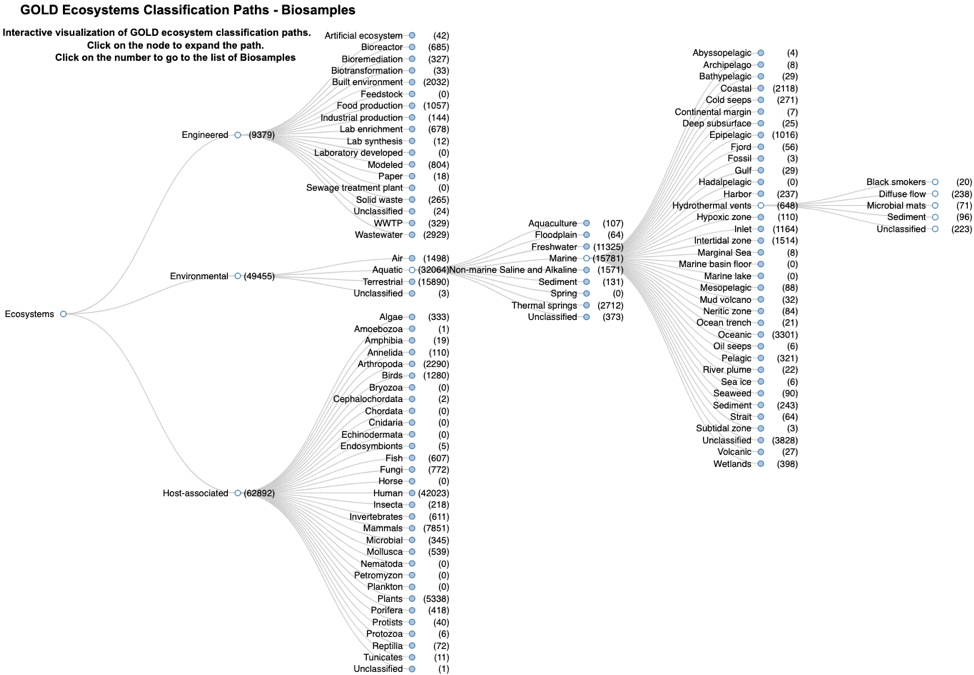
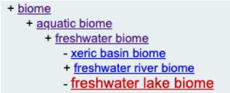
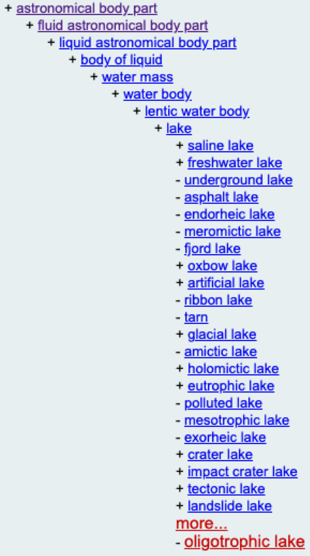
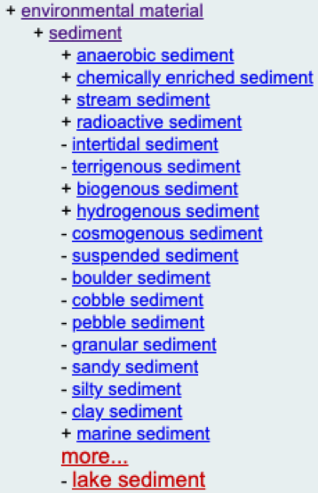

# The NMDC Metadata Standards Documentation

## Introduction

This documentation provides details on the National Microbiome Data
Collaborative's ([NMDC](http://microbiomedata.org)) approach to sample
and data processing metadata. These are key features that drive the data
search and discovery aspect of the NMDC data portal
(<https://microbiomedata.org/data/>). If you are unfamiliar with these
types of metadata (Figure 1), we recommend you begin with an
*Introduction to Metadata and Ontologies: Everything You Always Wanted
to Know About Metadata and Ontologies (But Were Afraid to Ask)*
(<https://doi.org/10.25979/1607365>).

{.align-center}

Figure 1: Microbiome metadata types: Information that contextualizes
sample including its geographic location and collection date, sample
preparation, data processing methods, and data products produced from a
biological sample (Luke et al., 2020. Introduction to Metadata and
Ontologies: Everything You Always Wanted to Know About Metadata and
Ontologies (But Were Afraid to Ask). DOI: 10.25979/1607365).

All data integrated into the NMDC data portal must adhere to existing
metadata standards for proper indexing and display, and to ensure
accurate search results are returned. This documentation outlines the
standards and ontologies that were included in the NMDC data schema, a
framework that defines how data were defined and linked. For the
2019-2022 pilot initiative, the NMDC Metadata Standards Team (see the
[NMDC Team page](https://microbiomedata.org/team/)) leveraged existing
community-driven standards developed by the [Genomics Standards
Consortium](https://gensc.org/) (GSC), the Joint Genome Institute (JGI)
[Genomes Online Database](https://gold.jgi.doe.gov/) (GOLD), and OBO
Foundry's [Environmental
Ontology](http://www.obofoundry.org/ontology/envo.html) (EnvO). In
collaboration with these organizations, the NMDC has created a framework
for mapping these standards into an interoperable framework that can be
expanded to include additional standards and ontologies in the future.

Additional information on the activities by the NMDC Metadata Standards
team can be found on the NMDC website at:
<https://microbiomedata.org/metadata/>

## Standards and Ontologies used by the NMDC

### Sample Metadata

#### GSC Minimum Information about any (x) Sequence (MIxS)

The GSC has developed standards for describing genomic and metagenomic
sequences, including the "minimum information about a genome sequence"
([MIGS](https://pubmed.ncbi.nlm.nih.gov/18464787/)), the "minimum
information about a metagenome sequence"
([MIMS](https://pubmed.ncbi.nlm.nih.gov/18464787/)), and the "minimum
information about a marker gene sequence"
([MIMARKS](https://pubmed.ncbi.nlm.nih.gov/21552244/)). To complement
this community-driven standard effort, the GSC has also developed a
system for describing the environment from which a biological sample
originates, as "environmental packages" and established a unified
standard set of checklists through the minimum information about any (x)
sequence (MIxS). MIxS provides a standardized data dictionary of sample
descriptors (e.g., location, environment, elevation, altitude, depth,
etc.) organized into different packages for 17 different sample
environments.

To standardize how physical samples are described (i.e., sample
metadata, Figure 1), the NMDC schema includes environmental descriptors
from the GSC MIxS standards.

*Explore how to create a MIxS-compliant sample metadata spreadsheet*

-   Review our example spreadsheet with sample metadata that has been
    converted to be compliant with the MIxS Soil environment package.
    Note that not all non-mandatory terms from the MIxs Soil package
    were relevant for these example samples, and hence were omitted for
    clarity.
    -   [Basic sample
        spreadsheet](https://docs.google.com/spreadsheets/d/1i2w2CEEHiMJZesi984LyU-ayaHKNFOCCN0TcPmKFda0/edit?usp=sharing)
        (Tab 1 - before conversion to MIxS)
    -   [MIxS-compliant soil
        spreadsheet](https://docs.google.com/spreadsheets/d/1i2w2CEEHiMJZesi984LyU-ayaHKNFOCCN0TcPmKFda0/edit?usp=sharing)
        (Tab 2 - converted to MIxS Soil)
-   Explore the mandatory, unique, and shared descriptors from the [MIxS
    Soil
    package](https://docs.google.com/document/d/1oNlMNQySuCoEeqhf1Qou8D-BV5bE76TkjrJLya8Ehw4/edit)
-   Searchable descriptors from **all** MIxS environmental packages
    *-coming soon!*
-   Learn more about all of the [17 MIxS environmental
    packages](https://gensc.org/mixs)

#### Genomes Online Database (GOLD)

The JGI [Genomes OnLine Database](https://gold.jgi.doe.gov/) (GOLD,
[Mukherjee 2021](https://pubmed.ncbi.nlm.nih.gov/33152092/)) is an
open-access repository of genome, metagenome, and metatranscriptome
sequencing projects with their associated metadata. GOLD data are
organized based on Study, Biosample/Organism, Sequencing Project and
Analysis Project ([Mukherjee
2017](https://pubmed.ncbi.nlm.nih.gov/30357420/)). Biosamples (defined
as the physical material collected from an environment) are described
using a five-level ecosystem classification [path (Figure
2)](https://pubmed.ncbi.nlm.nih.gov/20653767/); the NMDC schema also
uses this ecosystem classification to describe sample environments.

{.align-center}

Figure 2. The GOLD five-level ecosystem classification paths ([Mukherjee
2019](https://pubmed.ncbi.nlm.nih.gov/33152092/)).

*Overview of the GOLD ecosystem paths*

-   **Ecosystem** describes biosamples using three different broadest
    contexts, namely environmental, engineered, and host-associated.
-   **Ecosystem category** subdivides the ecosystem into categories,
    such as aquatic or terrestrial.
-   **Ecosystem type** classifies those categories into types, such as
    freshwater or marine, cave, desert, soil, etc.
-   **Ecosystem subtype** allows for additional environmental context or
    boundaries.
-   **Specific ecosystem** that describes the environment that directly
    influences the sample or the environmental material itself.

*Explore how to map sample environments using the GOLD ecosystem
classification*

-   Learn more about the GOLD ecosystem paths using an [interactive
    visualization tool](https://gold.jgi.doe.gov/ecosystemtree).
-   Review a
    [step-by-step](https://drive.google.com/file/d/1h-FVY26G_Q_OazkZrYmlTg4QhQUZTRFY/view?usp=sharing)
    example of how to assign the GOLD ecosystem classification to a lake
    sediment sample.

#### Environmental Ontology (EnvO)

The Environment Ontology (EnvO, [Buttigieg
2016](https://pubmed.ncbi.nlm.nih.gov/27664130/)) is a community-led
ontology that represents environmental entities such as biomes,
environmental features, and environmental materials. Each EnvO term is
identified using a unique *resource identifier* (e.g.,
[CURIE](https://en.wikipedia.org/wiki/CURIE) or
[IRI](https://en.wikipedia.org/wiki/Internationalized_Resource_Identifier))
that resolves in a web browser. This ensures that EnvO's terms (and
their definitions) are easy to find, reference, and share amongst
collaborators. It also ensures that datasets described using EnvO terms
can be more easily integrated and analyzed in a reproducible manner. And
since the meanings of the terms are precisely defined and accessible,
humans and computers can easily connect EnvO terms across datasets.

EnvO terms are the recommended values for several of the mandatory terms
in the MIxS packages, often referred to as the "MIxS triad".

-   **MIxS: env_broad_scale** (a.k.a. Biome): The major environmental
    system that the sample or specimen came from. Often, the value for
    this term comes from EnvO's
    [biome](http://www.ontobee.org/ontology/ENVO?iri=http://purl.obolibrary.org/obo/ENVO_00000428)
    hierarchy, and is similar to GOLD's *Ecosystem category.*
    -   Examples: forest biome, tropical biome, and oceanic pelagic zone
        biome
-   **MIxS: env_local_scale** (a.k.a. Feature): A more direct expression
    of the sample or specimen's local vicinity, which likely has a
    significant influence on the sample or specimen. Possible values are
    listed in EnvO's [astronomical body
    part](http://www.ontobee.org/ontology/ENVO?iri=http://purl.obolibrary.org/obo/ENVO_01000813)
    hierarchy, which is similar to GOLD's *Ecosystem type/subtype.*
    -   Examples: mountain, pond, whale fall, and karst
-   **MIxS: env_medium** (a.k.a. material): The environmental
    material(s) immediately surrounding your sample or specimen prior to
    sampling. Examples of this are found in EnvO's [environmental
    material](http://www.ontobee.org/ontology/ENVO?iri=http://purl.obolibrary.org/obo/ENVO_00010483)
    hierarchy, and is similar to GOLD's *Specific ecosystem.*
    -   Examples: sediment, soil, water, and air

*Explore how to map sample environments using the EnvO ecosystem
classification*

Review a step-by-step example of how to assign EnvO terms to an
oligotrophic lake sediment sample below.

Using EnvO biome categories, aquatic is appropriate. However, since the
EnvO is a hierarchical system, the aquatic biome has two sub-categories:
freshwater and marine biomes. The freshwater biome is further divided
into freshwater lake biome and freshwater river biome. Therefore, for a
lake sediment sample, freshwater lake biome is the appropriate EnvO
biome category.

{.align-center}

Next, we describe the local environmental feature in the vicinity of and
likely having a strong causal influence on the sample. Using the EnvO
astronomical body part categories, we step through the relevant
categories (see figure on the right) until we reach the EnvO term
oligotrophic lake.

{.align-center}

Finally, since the sample is oligotrophic lake sediment, the EnvO
environmental material could be assigned sediment. But because the EnvO
hierarchy provides sub-categories within sediment, the environmenta
material will be assigned lake sediment.

{.align-center}

Therefore, the EnvO triad for *oligotrophic lake sediment* is:

> **Env_broad_scale**: freshwater lake biome \[ENVO_01000252\]
>
> **Env_local_scale**: oligotrophic lake \[ENVO_01000774\]
>
> **Env_medium**: lake sediment \[ENVO_00000546\]

## Classifying samples with GOLD and MIxS/EnvO

The five-level GOLD ecosystem classification path and EnvO triad each
have unique advantages in describing the environmental context of a
biosample. The NMDC leverages the strengths of both the GOLD ecosystem
classification path and MIxS/EnvO triad. The assignment of MIxS/EnvO
triad for the biosamples currently in the NMDC data portal was achieved
through a manual curation process using various metadata fields of GOLD
biosamples fields, such as name, description, habitat, sample collection
site, identifier, ecosystem classification path, and study description.
The NMDC team is currently working on exploring solutions for automated
mapping between GOLD and MIxS/EnvO.

{.align-center}

Figure 3: Mapping between the MIxS/EnvO triad and the GOLD ecosystem
classification enables integration of sample environments defined with
GOLD and MIxS/EnvO.

## Data Processing Metadata

In addition, the NMDC is adopting the MIxS standards for sequence data
types (e.g., sequencing method, pcr primers and conditions, etc.), and
are building on previous efforts by the [Proteomics Standards
Initiative](http://www.psidev.info/groups/mass-spectrometry) and
[Metabolomics Standards
Initiative](https://github.com/MSI-Metabolomics-Standards-Initiative/CIMR)
to develop standards and controlled vocabularies for mass spectrometry
data types (e.g., ionization mode, mass resolution, scan rate, etc.).
*Additional details on the processing metadata are coming soon.*
