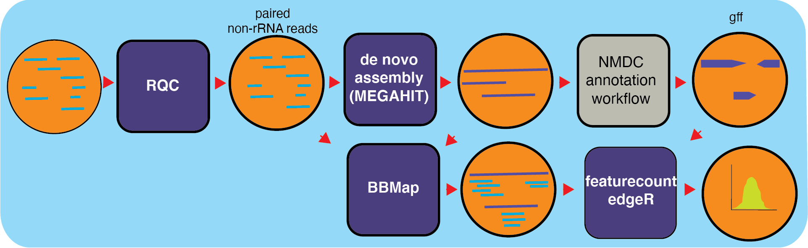

# Metatranscriptome Workflow (v0.0.2)

## Summary

MetaT is a workflow designed to analyze metatranscriptomes, building on
top of already existing NMDC workflows for processing input. The
metatranscriptoimics workflow takes in raw data and starts by quality
filtering the reads using the [RQC
worfklow](https://github.com/microbiomedata/ReadsQC). With filtered
reads, the workflow filters out rRNA reads (and separates the
interleaved file into separate files for the pairs) using bbduk
(BBTools). After the filtering steps, reads are assembled into
transcripts and using MEGAHIT and annotated using the [Metagenome
Anotation Workflow](https://github.com/microbiomedata/mg_annotation);
producing GFF funtional annotation files. Features are counted with
[Subread\'s featureCounts](http://subread.sourceforge.net/) which
assigns mapped reads to genomic features and generating RPKMs for each
feature in a GFF file for sense and antisense reads.

## Workflow Diagram



## Workflow Availability

The workflow uses the listed docker images to run all third-party tools.
The workflow is available in GitHub:
<https://github.com/microbiomedata/metaT>; and the corresponding Docker
images that have all the required dependencies are available in
following DockerHub (<https://hub.docker.com/r/microbiomedata/bbtools>,
<https://hub.docker.com/r/microbiomedata/meta_t>, and
<https://hub.docker.com/r/intelliseqngs/hisat2>)

Requirements for Execution (recommendations are in bold):
\-\-\-\-\-\-\-\-\-\-\-\-\-\-\-\-\-\-\-\-\-\-\-\-\-\-\-\-\-\-\-\-\-\-\-\-\-\-\-\-\-\-\-\-\-\-\-\-\-\-\-\-\-\-\--1.
WDL-capable Workflow Execution Tool (**Cromwell**) 2. Container Runtime
that can load Docker images (**Docker v2.1.0.3 or higher**)

## Workflow Dependencies

### Third-party software (These are included in the Docker images.)

1.  [BBTools v38.94](https://jgi.doe.gov/data-and-tools/bbtools/).
    (License:
    [BSD-3-Clause-LBNL](https://bitbucket.org/berkeleylab/jgi-bbtools/src/master/license.txt).)
2.  [BBMap v38.94](https://jgi.doe.gov/data-and-tools/bbtools/).
    (License:
    [BSD-3-Clause-LBNL](https://bitbucket.org/berkeleylab/jgi-bbtools/src/master/license.txt).)
3.  [Python v3.7.6](https://www.python.org/). (License: Python Software
    Foundation License)
4.  [featureCounts v2.0.2](http://subread.sourceforge.net/). (License:
    GNU-GPL)
5.  [R v3.6.0](https://www.r-project.org/). (License: GPL-2/GPL-3)
6.  [edgeR
    v3.28.1](https://bioconductor.org/packages/release/bioc/html/edgeR.html).
    (R package) (License: GPL (\>=2))
7.  [pandas v1.0.5](https://pandas.pydata.org/). (python package)
    (License: BSD-3-Clause)
8.  [gffutils v0.10.1](https://pythonhosted.org/gffutils/). (python
    package) (License: MIT)

### Requisite database

The RQCFilterData Database must be downloaded and installed. This is a
106 GB tar file which includes reference datasets of artifacts,
adapters, contaminants, the phiX genome, rRNA kmers, and some host
genomes. The following commands will download the database:

``` bash
wget http://portal.nersc.gov/dna/microbial/assembly/bushnell/RQCFilterData.tar
tar -xvf RQCFilterData.tar
rm RQCFilterData.tar  
```

## Sample dataset(s)

The following files are provided with the GitHub download in the
test_data folder:

1.  Raw reads: test_data/test_interleave.fastq.gz (output from ReadsQC
    workflow)
2.  Annotation file: test_functional_annotation.gff (output from
    mg_annotation workflow)

### Input: A JSON file containing the following

1.  a name for the analysis
2.  the number of cpus requested
3.  the path to the clean input interleaved fastq file (recommended: the
    output from the Reads QC workflow)
4.  the path to the rRNA_kmer database provided as part of RQCFilterData
5.  the path to the assembled transcripts (output of part 1)
6.  the paths to the reads with rRNA removed (paired-end files) (output
    of part 1)
7.  the path to the annotation file (from the Metagenome Annotation
    workflow)

An example JSON file is shown below:

``` JSON
{
  "metat_omics.project_name": "test",
  "metat_omics.no_of_cpus": 1,
  "metat_omics.rqc_clean_reads": "test_data/test_interleave.fastq",
  "metat_omics.ribo_kmer_file": "/path/to/riboKmers20fused.fa.gz",
  "metat_omics.metat_contig_fn": "/path/to/megahit_assem.contigs.fa",
  "metat_omics.non_ribo_reads": [
    "/path/to/filtered_R1.fastq",
    "/path/to/filtered_R2.fastq"
  ],
  "metat_omics.ann_gff_fn": "test_data/test_functional_annotation.gff"
}
```

### Output

Output is split up between steps of the workflow. The first half of the
workflow will output rRNA-filtered reads and the assembled transcripts.
After annotations and featureCount steps include a JSON file that
contain RPKMs for both sense and antisense, reads, and information from
annotation for each feature. An example of JSON outpus:

``` JSON
{
       "featuretype": "transcript",
       "seqid": "k123_15",
       "id": "STRG.2.1",
       "source": "StringTie",
       "start": 1,
       "end": 491,
       "length": 491,
       "strand": ".",
       "frame": ".",
       "extra": [],
       "cov": "5.928717",
       "FPKM": "76638.023438",
       "TPM": "146003.046875"
   }
```

Below is an example of the output directory files with descriptions to
the right.

  : Title

  ----------------------------------------------------------------------------------------
  Directory/File Name                      Description
  ---------------------------------------- -----------------------------------------------
  metat_output/sense_out.json              RPKM for each feature on + strand

  metat_output/antisense_out.json          RPKM for each feature on - strand

  assembly/megahit_assem.contigs.fa        assembled transcripts

  mapback/mapped_sorted.bam                alignment of reads and transcripts

  qa/\_interleaved.fastq                   non-ribosomal reads

  qa/filterStats.txt                       summary statistics in JSON format

  qa/filterStats2.txt                      more detailed summary statistics

  annotation/annotations.json              annotation information

  annotation/features.json                 feature information

  annotation/\_cath_funfam.gff             features from cath database

  annotation/\_cog.gff                     features from cog databse

  annotation/\_ko_ec.gff                   features from ko database

  annotation/\_pfam.gff                    features from pfam database

  annotation/\_smart.gff                   features from smart database

  annotation/\_structural_annotation.gff   structural features

  annotation/\_supfam.gff                  features from supfam databse

  annotation/\_tigrfam.gff                 features from trigfam database

  annotation/\_functional_annotation.gff   functional features

  annotation/\_ec.tsv                      ec terms tsv

  annotation/\_ko.tsv                      ko terms tsv

  annotation/proteins.faa                  fasta containing protiens
  ----------------------------------------------------------------------------------------

  : Title

## Version History

-   0.0.2 (release date 01/14/2021; previous versions: 0.0.1)

\- 0.0.3 (release date 07/28/2021; previous versions: 0.0.2) Points of
contact \-\-\-\-\-\-\-\-\-\-\-\-\-\-\-\-\-- Author: Migun Shakya
\<<migun@lanl.gov>\>
