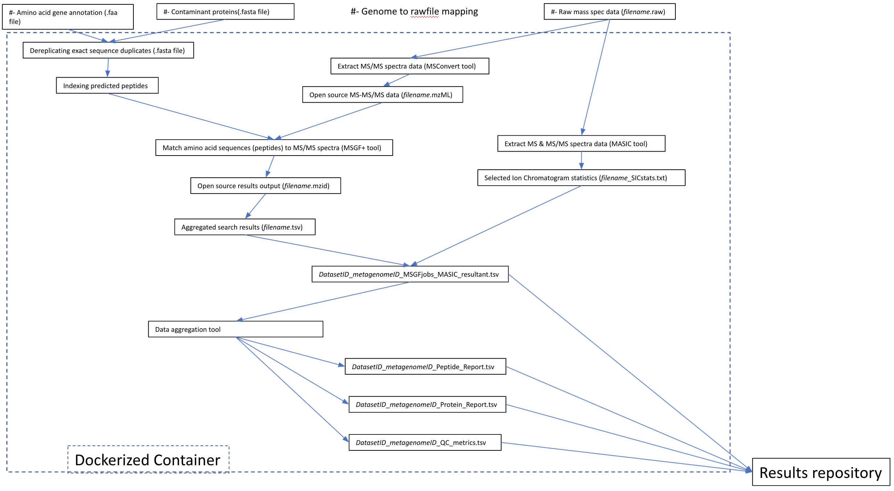

Metaproteomic Workflow (v2.0.0) 
==============================

# Summary

The metaproteomics workflow/pipeline is an end-to-end data processing
workflow for protein identification and characterization using MS/MS
data. Briefly, mass spectrometry instrument generated data files(.RAW)
are converted to mzML, an open data format, using MSConvert. Peptide
identification is achieved using MSGF+ and the associated metagenomic
information in the FASTA (protein sequences) file format. Intensity
information for identified species is extracted using MASIC and combined
with protein information.

-   **Processing components:**
    -   [msConvert](http://proteowizard.sourceforge.net/tools/msconvert.html)
        : A command-line tool converting to/from various mass
        spectrometry data formats including multiple proprietary
        formats. It converts.RAW to [mzML](http://www.psidev.info/mzML).
        Converting to mzML which is an [open data
        format](https://www.ncbi.nlm.nih.gov/pmc/articles/PMC3518119/)
        makes easy for academic scientists to directly manipulate MS/MS
        spectrum data. Open formats enable improved data sharing by
        allowing the data to be read by a variety of software tools
        without licensing restrictions
    -   [MS-GF+](https://www.nature.com/articles/ncomms6277) which
        performs peptide identification by scoring MS/MS spectra against
        peptides derived from a protein sequence database (FASTA files).
        Individual peptide sequences are identified(mzML file), then the
        set of peptide sequences is used to infer which proteins may
        have been present. It reads an open data format for MS/MS
        identification i.e mzML files and searches again a protein
        database(FASTA) to outputs a .mzId file which constitutes a set
        of scored PSMs along with *E*-value estimates( i.e computes
        *E*-values of PSMs and estimates FDRs)
    -   [MzidToTSVConverter](https://msgfplus.github.io/msgfplus/MzidToTsv.html)
        to converts MS-GF+ output (**.mzid**) into the tsv format
        (**.tsv**).
    -   [PeptideHitResultsProcessor](https://omics.pnl.gov/software/peptide-hit-results-processor),
        converts tsv format (**.tsv**) to syn.txt file used for
        downstream analyses.
    -   [MASIC](https://www.ncbi.nlm.nih.gov/pmc/articles/PMC2487672/)
        which extracts intensity information for the identified
        peptides. It accurately measures peptide abundances and elution
        times in an LC-MS/MS analysis. It reads .Raw files from Thermo
        Fisher mass spectrometers and generates .SIC files i.e "selected
        ion chromatograms" (SICs) for each species chosen for MS/MS
        fragmentation.
-   **Analyzing component:**
    -   MePro component of the workflow
        -   Reads in syn.txt files & calculated the best scoring
            peptides for each scan.
        -   Even though, MSGF+ estimates False discovery rates(FDRs) in
            some datasets MSGFplus tool when dealing with SPLIT
            FASTAs(multiple FASTA for the same sample) doesn't actually
            account all of them due to which the QValue and PepQValue
            value aren't based on the entire FASTA file for that
            dataset. Therefore, we're recomputing QValue and PepQValue
            to improve the FDR.
        -   merges the outputs from MSGF+ and MASIC, and applies to
            filter to control the false discovery rate. The output is a
            crosstab format table with rows containing protein sequence
            information, and columns with relative abundance
            measurements for proteins identified in each sample
            analyzed.

# Workflow Diagram



# Workflow Dependencies

## Third party software

``` bash
|----------------------------|------------------------------------------|
| MSGFPlus                   | v20190628                                |
| Mzid-To-Tsv-Converter      | v1.3.3                                   |
| PeptideHitResultsProcessor | v1.5.7130                                |
| pwiz-bin-windows           | x86_64-vc141-release-3_0_20149_b73158966 |
| MASIC                      | v3.0.7235                                |
| sqlite-netFx-full-source   | 1.0.111.0                                |
```

# Workflow Availability

The workflow is available in GitHub:
<https://github.com/microbiomedata/metaPro>

## Inputs

-  .raw, metagenome, parameter files : MSGFplus & MASIC, contaminant_file

## Outputs

1.  Processing multiple datasets.

2.  Processing single FICUS dataset.

``` bash
| Keys               | Values                                                                   |
|--------------------|--------------------------------------------------------------------------|
| id                 | str: "md5 hash of $github_url+$started_at_time+$ended_at_time"           |
| name               | str: "Metagenome:$proposal_extid_$sample_extid:$sequencing_project_extid |
| was_informed_by    | str: "GOLD_Project_ID"                                                   |
| started_at_time    | str: "metaPro start-time"                                                |
| ended_at_time      | str: "metaPro end-time"                                                  |
| type               | str: tag: "nmdc:metaPro"                                                 |
| execution_resource | str: infrastructure name to run metaPro                                  |
| git_url            | str: "url to a release"                                                  |
| dataset_id         | str: "dataset's unique-id at EMSL"                                       |
| dataset_name       | str: "dataset's name at EMSL"                                            |
| has_inputs         | json_obj                                                                 |
| has_outputs        | json_obj                                                                 |
| stats              | json_obj                                                                 |

has_inputs :
| MSMS_out         | str: file_name \|file_size \|checksum                                                                                     |
| metagenome_file  | str: file_name \|file_size \|checksum \|
                     int: entry_count(#of gene sequences) \|
                     int: duplicate_count(#of duplicate gene sequences) |
| parameter_files  | str: for_masic/for_msgfplus : file_name \|file_size \|checksum
                     parameter file used for peptide identification search
| Contaminant_file | str: file_name \|file_size \|checksum
                     (FASTA containing common contaminants in proteomics)

has_outputs:
| collapsed_fasta_file | str: file_name \|file_size \|checksum                                           |
| resultant_file       | str: file_name \|file_size \|checksum                                           |
| data_out_table       | str: file_name \|file_size \|checksum                                           |

stats:
| from_collapsed_fasta | int: entry_count(#of unique gene sequences)                                                                                                                                                                                                                                                                                                                                                                                                                                                                  |
| from_resultant_file  | int: total_protein_count                                                                                                                                                                                                                                                                                                                                                                                                                                                                                          |
| from_data_out_table  | int: PSM(# of MS/MS spectra matched to a peptide sequence at 5% false discovery rate (FDR)
                         float: PSM_identification_rate(# of peptide matching MS/MS spectra divided by total spectra searched (5% FDR)
                         int: unique_peptide_seq_count(# of unique peptide sequences observed in pipeline analysis 5% FDR)
                         int: first_hit_protein_count(# of proteins observed assuming single peptide-to-protein relationships)
                         int: mean_peptide_count(Unique peptide sequences matching to each identified protein.)
```

\[more about the NMDC
schema\](<https://github.com/microbiomedata/nmdc-schema/blob/main/jsonschema/nmdc.schema.json>)

-   data_out_table

``` bash
| DatasetName | PeptideSequence | FirstHitProtein | SpectralCount | sum(MasicAbundance) | GeneCount | FullGeneList | FirstHitDescription | DescriptionList | min(Qvalue) |
```

-   collapsed_fasta_file
-   resultant_file

# Requirements for Execution

-   Docker or other Container Runtime

# Version History

-   1.0.0
-   2.0.0

# Point of contact

Package maintainer: Anubhav \<<anubhav@pnnl.gov>\>
